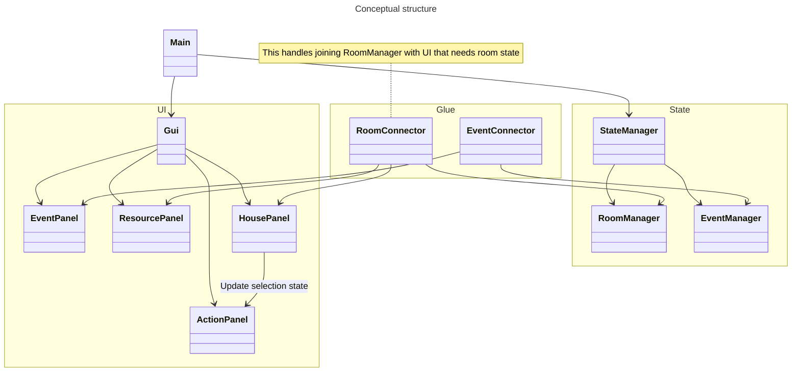

There's kind of three things going on here. There's the UI layout structure, then the state, then the events that need to update both. I somewhat already have the state modelled, so I guess this is more about UI elements and what joins things together. Where is the glue?