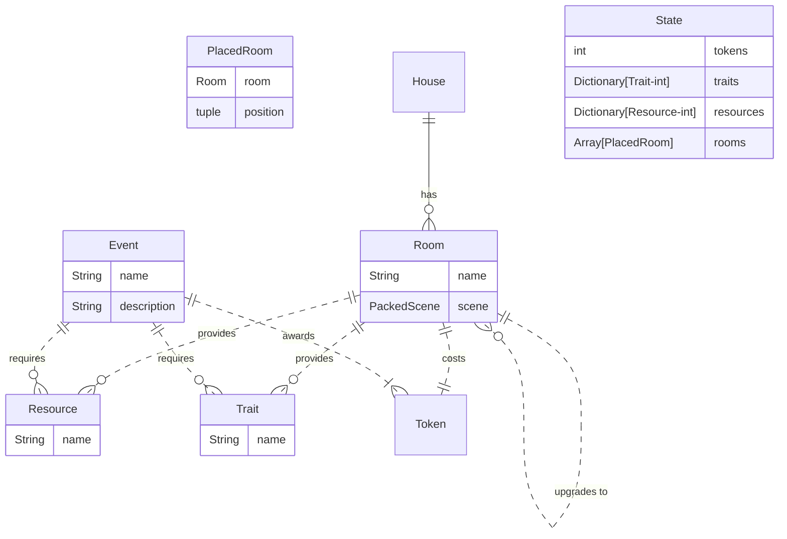

```mermaid
erDiagram
	Resource {
		String name
	}
	Trait {
		String name
	}
	Room {
		String name
		PackedScene scene
	}
	PlacedRoom {
		Room room
		tuple position
	}
	Event {
		String name
		String description
	}
	House {}
	Token {}
	State {
	    int tokens
	    Dictionary[Trait-int] traits
	    Dictionary[Resource-int] resources
	    Array[PlacedRoom] rooms
	}
	
	
	Room ||..o{ Trait : provides
	Room ||..o{ Resource : provides
	Event ||..o{ Trait : requires
	Event ||..o{ Resource : requires
	Room ||..o{ Room : "upgrades to"
	House ||--o{ Room : "has"
	Room ||..|| Token : "costs"
	Event ||..|{ Token : "awards"
```
